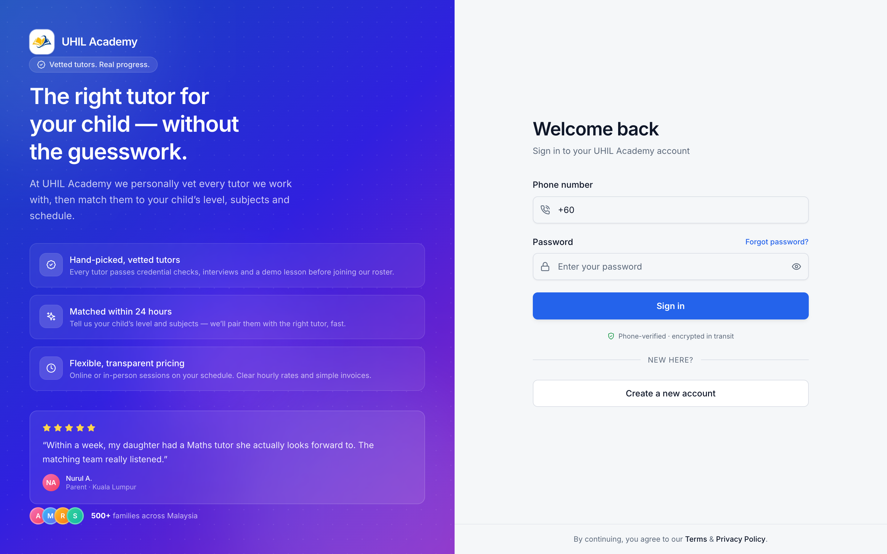

# UHIL Academy — Admin Dashboard

Operations dashboard for [UHIL Academy](https://academy-dashboard-eosin.vercel.app),
a Malaysian tutoring service. It handles the whole back office: matching
vetted tutors to students, scheduling lessons, tracking attendance, and
generating invoices and deposits for parents.

**Live:** https://academy-dashboard-eosin.vercel.app



## What it does

- **Tutor matching** — inbound parent inquiries land in a queue; admins review
  tutor profiles and assign a tutor to a student.
- **Approvals** — new tutors are vetted before they join the roster.
- **Lessons** — schedule, update and track lessons per student.
- **Billing** — generate invoices and deposit slips per student, with an
  invoice table and PDF-ready pages.
- **Roles** — separate admin, tutor and parent views behind role-aware
  middleware.
- **Kanban board** and dashboard charts for pipeline and revenue at a glance.

## Stack

Next.js 15 (App Router) · React 19 · TypeScript · Prisma · NextAuth v5 ·
Tailwind CSS · Radix UI / shadcn · Zustand · Recharts · Nodemailer

## Running locally

```bash
cp .env.example .env          # database URL, auth secret, SMTP creds
npm install
npx prisma migrate dev
npm run dev                   # http://localhost:3000
```

Docker is also wired up:

```bash
docker compose up
```

See [README.Docker.md](README.Docker.md) for details.

## Layout

```
app/(dashboard)/dashboard/
├── approvals/        tutor vetting queue
├── assign-tutor/     matching flow
├── inquiries/        inbound parent requests
├── lesson/           scheduling + updates
├── generateinvoice/  invoicing
├── generatedeposit/  deposit slips
├── parent/  student/  tutor/
└── kanban/
auth.ts, auth.config.ts, middleware.ts    NextAuth v5 + route protection
```
